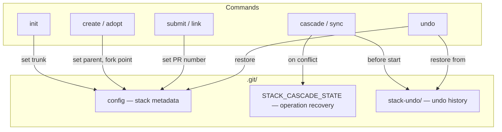

# Architecture: Data Storage

gh-stack minimizes state. It stores only the metadata it needs, using standard Git facilities—`git-config` and plain files in `.git/`—rather than maintaining its own object store or custom database. This is a deliberate trade-off: simplicity and speed over robustness and history.

Everything lives inside `.git/`, so nothing is committed to your repository or shared between clones.

## Storage Locations

gh-stack uses three storage mechanisms:

- **`.git/config`** — Stack metadata (persistent). Git config key-value pairs.
- **`.git/STACK_CASCADE_STATE`** — In-progress operation recovery. A single JSON file.
- **`.git/stack-undo/`** — Undo snapshots. A directory of JSON files.

## Stack Metadata

The core data model lives in `.git/config` as standard Git configuration keys:

```ini
[stack]
    trunk = main

[branch "feature-auth"]
    stackParent = main
    stackPR = 123
    stackForkPoint = abc123def456...
```

### Keys

| Key                            | Value       | Purpose                                              |
| ------------------------------ | ----------- | ---------------------------------------------------- |
| `stack.trunk`                  | Branch name | The base branch for all stacks (usually `main`)      |
| `branch.<name>.stackParent`    | Branch name | Parent branch in the stack hierarchy                 |
| `branch.<name>.stackPR`        | Integer     | Associated GitHub PR number                          |
| `branch.<name>.stackForkPoint` | Commit SHA  | Where the branch originally diverged from its parent |

### When Metadata Is Written

| Command           | Writes                                                           |
| ----------------- | ---------------------------------------------------------------- |
| `init`            | `stack.trunk`                                                    |
| `create`, `adopt` | `stackParent`, `stackForkPoint`                                  |
| `submit`, `link`  | `stackPR`                                                        |
| `sync`            | Updates `stackParent`, `stackForkPoint` during rebase operations |
| `orphan`          | Removes `stackParent`, `stackPR`, `stackForkPoint`               |
| `unlink`          | Removes `stackPR`                                                |
| `undo`            | Restores any of the above from a snapshot                        |

### Trade-offs

**Why `git-config`?** It requires zero parsing code. Git's config machinery handles escaping, sections, quoting, and file locking. Reading and writing are single subprocess calls (`git config --get` / `git config key value`). Users can inspect and repair state with `git config --edit` or any text editor.

**What this costs us:**

- **No transactional updates.** Each `git config` call is independent. A crash mid-operation (say, between writing `stackParent` and `stackForkPoint`) could leave partial state. The undo system mitigates this.
- **Not portable between clones.** `.git/config` is local. You cannot transfer stack relationships to another clone. In practice this hasn't mattered—stacks are a local workflow concern.
- **Case normalization.** Git normalizes config keys to lowercase, so `stackParent` becomes `stackparent` in the file. The code handles this explicitly when listing tracked branches via `--get-regexp`.
- **No caching.** Every read forks a `git config` subprocess. This is fast enough for interactive use, but means operations that read many branches (like `log`) make many subprocess calls.

## Cascade State

When a multi-branch rebase is interrupted by a conflict, gh-stack saves the operation state so you can resume with `gh stack continue` or cancel with `gh stack abort`.

**File:** `.git/STACK_CASCADE_STATE`
**Format:** JSON (indented, human-readable)

```json
{
  "current": "feature-b",
  "pending": ["feature-c", "feature-d"],
  "original_head": "abc123...",
  "operation": "submit",
  "update_only": false,
  "web": false,
  "push_only": false,
  "branches": ["feature-a", "feature-b", "feature-c", "feature-d"],
  "stash_ref": "def456..."
}
```

### Fields

| Field                             | Purpose                                                                    |
| --------------------------------- | -------------------------------------------------------------------------- |
| `current`                         | Branch where the conflict occurred                                         |
| `pending`                         | Remaining branches to rebase                                               |
| `original_head`                   | HEAD before the operation started (for abort)                              |
| `operation`                       | `"cascade"` or `"submit"`                                                  |
| `stash_ref`                       | Commit hash of auto-stashed uncommitted changes                            |
| `branches`                        | Full branch list (submit only; used to rebuild the set for push/PR phases) |
| `update_only`, `web`, `push_only` | Submit-specific flags preserved across continue                            |

### Cascade State Lifecycle

1. **Created** when a rebase conflict interrupts `cascade`, `submit`, or `sync`.
2. **Removed** before `continue` resumes (will be recreated if another conflict occurs).
3. **Removed** on successful completion or `abort`.

### Cascade State Trade-offs

This is an ephemeral, single-operation state file. It is not designed to survive beyond the operation that created it.

- **Single-operation scope.** Only one cascade/submit/sync can be in progress at a time. The code checks for this file and refuses to start a new operation if one exists.
- **Best-effort persistence.** Save errors are ignored (`//nolint:errcheck`) because if we can't save state, the user can still recover manually by aborting the rebase and re-running the command.

## Undo Snapshots

Before any destructive operation, gh-stack captures a snapshot of every affected branch's state. This provides multi-level undo without requiring a full state history.

**Directory:** `.git/stack-undo/`
**Archive:** `.git/stack-undo/done/`
**Format:** JSON files named `{timestamp}-{operation}.json`

```json
{
  "timestamp": "2026-02-05T12:00:00Z",
  "operation": "cascade",
  "command": "gh stack cascade",
  "original_head": "abc123...",
  "stash_ref": "",
  "branches": {
    "feature-auth": {
      "sha": "def456...",
      "stack_parent": "main",
      "stack_pr": 123,
      "stack_fork_point": "789abc..."
    }
  },
  "deleted_branches": {}
}
```

### Snapshot Lifecycle

1. **Created** before destructive operations (`cascade`, `submit`, `sync`).
2. **Used** by `undo`, which restores branch refs and config keys from the snapshot.
3. **Archived** to `done/` after a successful undo.
4. **Pruned** automatically: max 50 active snapshots and 50 archived. Oldest are removed first.

### Snapshot Trade-offs

- **Timestamp-based naming.** Filenames use nanosecond-precision timestamps to avoid collisions. Lexicographic sorting gives chronological ordering for free.
- **Bounded growth.** Auto-pruning means no manual cleanup is needed, but also means very old snapshots silently disappear.
- **No shared state.** Like everything else, snapshots are local to the clone.
- **Captures the "before" picture only.** The snapshot records pre-operation state, not the operation itself. This is simpler than maintaining a full operation log, and in practice, "undo the last thing" is what you actually want.

## Data Flow



## Implementation

| Concern                     | Package           | Notes                                                    |
| --------------------------- | ----------------- | -------------------------------------------------------- |
| Stack metadata (git-config) | `internal/config` | Direct `exec.Command("git", "config", ...)` calls        |
| Cascade state               | `internal/state`  | `json.MarshalIndent` / `json.Unmarshal` + `os.WriteFile` |
| Undo snapshots              | `internal/undo`   | Same JSON approach, plus directory listing and pruning   |
| Git operations              | `internal/git`    | Uses `safeexec.LookPath` with `sync.Once` caching        |
| Tree construction           | `internal/tree`   | Builds in-memory tree from config for traversal          |

Note that `internal/config` and `internal/git` both execute Git subprocesses, but use slightly different patterns. `internal/git` uses `safeexec.LookPath` to prevent PATH injection (important on Windows); `internal/config` calls `exec.Command("git", ...)` directly. This is a known inconsistency.
