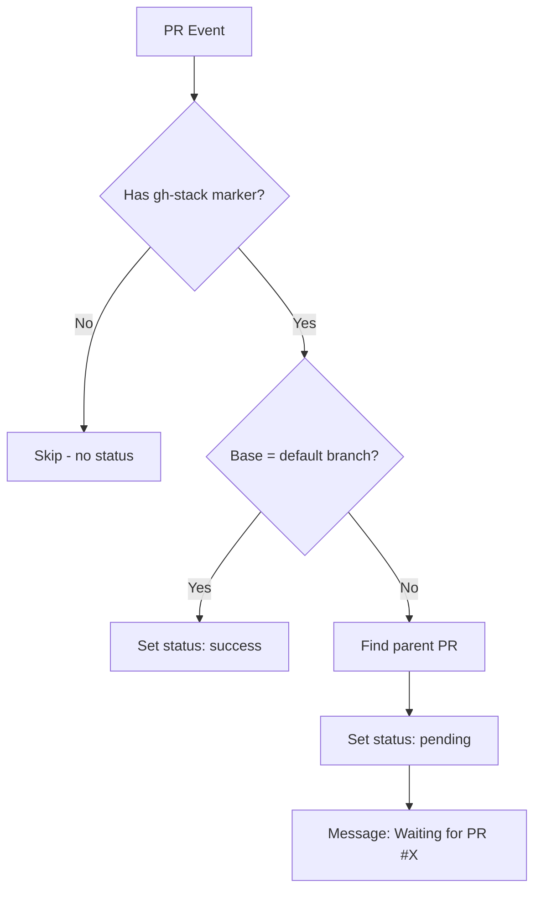

# gh-stack-check: GitHub Action Design

A GitHub Action that prevents premature merging of stacked PRs by setting a commit status that blocks merging until the PR targets the default branch.

## Problem Statement

When working with stacked PRs:

```
main <- PR #1 (feature-a) <- PR #2 (feature-b) <- PR #3 (feature-c)
```

If someone merges PR #2 before PR #1 is merged, the commits from PR #2 land in PR #1's diff, causing:
- Duplicate review effort (reviewers see the same commits twice)
- Confusion about what changes belong to which PR
- Messy git history

Tools like Graphite solve this with a bespoke web UI. This action provides a lightweight, GitHub-native solution using commit statuses and branch protection rules.

## Solution Overview

A reusable GitHub Action that:

1. Triggers on `pull_request` events
2. Detects gh-stack managed PRs via the `<!-- gh-stack:nav -->` comment marker
3. Sets a commit status:
   - **Pending** when base branch != default branch
   - **Success** when base branch = default branch
4. Ignores PRs that aren't managed by gh-stack (no status created)

Combined with GitHub branch protection rules requiring status checks, this effectively blocks merging until the parent PR is merged and `gh stack sync` updates the base branch.

## Data Flow



## Technical Design

### Action Inputs

| Input | Required | Default | Description |
|-------|----------|---------|-------------|
| `github-token` | Yes | `${{ github.token }}` | Token for API access |
| `status-context` | No | `gh-stack` | Name of the commit status |

### Action Outputs

| Output | Description |
|--------|-------------|
| `status` | The status that was set: `success`, `pending`, or `skipped` |
| `parent-pr` | The parent PR number (if applicable) |

### Detection Logic

**Step 1: Check for gh-stack marker**

Query the PR's comments for one containing `<!-- gh-stack:nav -->`:

```
GET /repos/{owner}/{repo}/issues/{pr_number}/comments
```

If no comment contains the marker, skip this PR (output `status: skipped`).

**Step 2: Determine default branch**

```
GET /repos/{owner}/{repo}
```

Extract `default_branch` from response.

**Step 3: Check base branch**

From the `pull_request` event payload:
- `github.event.pull_request.base.ref` - the base branch

If `base.ref === default_branch`, set status to success.

**Step 4: Find parent PR (for pending status message)**

Query for open PRs where the head branch matches this PR's base branch:

```
GET /repos/{owner}/{repo}/pulls?state=open&head={owner}:{base_ref}
```

This finds the "parent" PR in the stack.

**Step 5: Set commit status**

```
POST /repos/{owner}/{repo}/statuses/{sha}
{
  "state": "success" | "pending",
  "context": "gh-stack",
  "description": "Ready to merge" | "Waiting for PR #X to merge",
  "target_url": "https://github.com/{owner}/{repo}/pull/{parent_pr}"
}
```

### Workflow Triggers

The action should be triggered on:

```yaml
on:
  pull_request:
    types: [opened, edited, synchronize, reopened]
  issue_comment:
    types: [created, edited]
```

The `issue_comment` trigger handles the case where gh-stack adds its navigation comment after the PR is opened.

### Edge Cases

1. **PR opened before gh-stack comment added**: The `issue_comment` trigger handles this - when the comment is added, the action re-runs.

2. **Parent PR merged but child not yet retargeted**: Status remains pending until `gh stack sync` updates the base branch, which triggers `pull_request.edited`.

3. **Multiple PRs targeting the same branch**: The action finds the first open PR with matching head. This is fine - we just need *a* parent to display in the message.

4. **Orphaned stack (parent branch deleted)**: If no parent PR is found but base != default, show generic "Waiting for base branch to be merged" message.

5. **Race condition with sync**: After parent merges, there's a window where child PR base is being updated. The pending status remains until the base branch actually changes.

---

## Implementation Plan

### Phase 1: Project Setup

#### Task 1.1: Initialize Action Repository

**Files:**
- Create: `action.yml`
- Create: `package.json`
- Create: `.gitignore`
- Create: `tsconfig.json`

**Step 1: Create action metadata**

```yaml
# action.yml
name: 'gh-stack Check'
description: 'Prevents premature merging of stacked PRs by blocking until the PR targets the default branch'
author: 'boneskull'

branding:
  icon: 'git-pull-request'
  color: 'purple'

inputs:
  github-token:
    description: 'GitHub token for API access'
    required: true
    default: ${{ github.token }}
  status-context:
    description: 'Name of the commit status'
    required: false
    default: 'gh-stack'

outputs:
  status:
    description: 'The status that was set (success, pending, or skipped)'
  parent-pr:
    description: 'The parent PR number, if applicable'

runs:
  using: 'node20'
  main: 'dist/index.js'
```

**Step 2: Create package.json**

```json
{
  "name": "gh-stack-check",
  "version": "0.0.0",
  "description": "GitHub Action to prevent premature merging of stacked PRs",
  "main": "dist/index.js",
  "scripts": {
    "build": "ncc build src/index.ts -o dist --source-map --license licenses.txt",
    "test": "vitest",
    "lint": "eslint src/",
    "typecheck": "tsc --noEmit"
  },
  "keywords": ["github", "action", "stacked-prs", "gh-stack"],
  "author": "boneskull",
  "license": "Apache-2.0",
  "devDependencies": {
    "@actions/core": "^1.10.1",
    "@actions/github": "^6.0.0",
    "@types/node": "^20.11.0",
    "@vercel/ncc": "^0.38.1",
    "typescript": "^5.3.3",
    "vitest": "^1.2.0",
    "eslint": "^8.56.0"
  }
}
```

**Step 3: Create tsconfig.json**

```json
{
  "compilerOptions": {
    "target": "ES2022",
    "module": "commonjs",
    "lib": ["ES2022"],
    "strict": true,
    "esModuleInterop": true,
    "skipLibCheck": true,
    "forceConsistentCasingInFileNames": true,
    "outDir": "./dist",
    "rootDir": "./src",
    "declaration": true,
    "sourceMap": true
  },
  "include": ["src/**/*"],
  "exclude": ["node_modules", "dist"]
}
```

**Step 4: Create .gitignore**

```gitignore
node_modules/
*.log
.DS_Store
```

**Step 5: Install dependencies**

```bash
npm install
```

---

### Phase 2: Core Implementation

#### Task 2.1: Main Entry Point

**Files:**
- Create: `src/index.ts`

**Step 1: Implement main function**

```typescript
// src/index.ts
import * as core from '@actions/core';
import * as github from '@actions/github';
import { checkStackStatus } from './check';

async function run(): Promise<void> {
  try {
    const token = core.getInput('github-token', { required: true });
    const statusContext = core.getInput('status-context') || 'gh-stack';

    const octokit = github.getOctokit(token);
    const context = github.context;

    // Handle both pull_request and issue_comment events
    let prNumber: number;
    
    if (context.eventName === 'pull_request') {
      prNumber = context.payload.pull_request?.number;
    } else if (context.eventName === 'issue_comment') {
      // issue_comment on a PR
      prNumber = context.payload.issue?.number;
      if (!context.payload.issue?.pull_request) {
        core.info('Comment is not on a pull request, skipping');
        core.setOutput('status', 'skipped');
        return;
      }
    } else {
      core.setFailed(`Unsupported event: ${context.eventName}`);
      return;
    }

    if (!prNumber) {
      core.setFailed('Could not determine PR number');
      return;
    }

    const result = await checkStackStatus({
      octokit,
      owner: context.repo.owner,
      repo: context.repo.repo,
      prNumber,
      statusContext,
    });

    core.setOutput('status', result.status);
    if (result.parentPR) {
      core.setOutput('parent-pr', result.parentPR.toString());
    }

    core.info(`Status set to: ${result.status}`);
  } catch (error) {
    if (error instanceof Error) {
      core.setFailed(error.message);
    } else {
      core.setFailed('An unexpected error occurred');
    }
  }
}

run();
```

---

#### Task 2.2: Stack Check Logic

**Files:**
- Create: `src/check.ts`

**Step 1: Implement check logic**

```typescript
// src/check.ts
import * as core from '@actions/core';
import type { GitHub } from '@actions/github/lib/utils';

const STACK_COMMENT_MARKER = '<!-- gh-stack:nav -->';

export interface CheckOptions {
  octokit: InstanceType<typeof GitHub>;
  owner: string;
  repo: string;
  prNumber: number;
  statusContext: string;
}

export interface CheckResult {
  status: 'success' | 'pending' | 'skipped';
  parentPR?: number;
}

export async function checkStackStatus(options: CheckOptions): Promise<CheckResult> {
  const { octokit, owner, repo, prNumber, statusContext } = options;

  // Step 1: Get PR details
  const { data: pr } = await octokit.rest.pulls.get({
    owner,
    repo,
    pull_number: prNumber,
  });

  const baseBranch = pr.base.ref;
  const headSha = pr.head.sha;

  // Step 2: Check for gh-stack marker in comments
  const hasMarker = await hasStackMarker(octokit, owner, repo, prNumber);
  
  if (!hasMarker) {
    core.info(`PR #${prNumber} is not managed by gh-stack (no marker found)`);
    return { status: 'skipped' };
  }

  core.info(`PR #${prNumber} is managed by gh-stack`);

  // Step 3: Get default branch
  const { data: repoData } = await octokit.rest.repos.get({
    owner,
    repo,
  });
  const defaultBranch = repoData.default_branch;

  // Step 4: Check if base is default branch
  if (baseBranch === defaultBranch) {
    core.info(`PR #${prNumber} targets ${defaultBranch} - ready to merge`);
    
    await setCommitStatus(octokit, {
      owner,
      repo,
      sha: headSha,
      context: statusContext,
      state: 'success',
      description: `Ready to merge (targets ${defaultBranch})`,
    });

    return { status: 'success' };
  }

  // Step 5: Find parent PR
  const parentPR = await findParentPR(octokit, owner, repo, baseBranch);
  
  let description: string;
  let targetUrl: string | undefined;

  if (parentPR) {
    description = `Waiting for PR #${parentPR.number} to merge`;
    targetUrl = parentPR.html_url;
    core.info(`PR #${prNumber} is blocked by parent PR #${parentPR.number}`);
  } else {
    description = `Waiting for ${baseBranch} to become ${defaultBranch}`;
    core.info(`PR #${prNumber} targets ${baseBranch}, not ${defaultBranch}`);
  }

  await setCommitStatus(octokit, {
    owner,
    repo,
    sha: headSha,
    context: statusContext,
    state: 'pending',
    description,
    targetUrl,
  });

  return { 
    status: 'pending',
    parentPR: parentPR?.number,
  };
}

async function hasStackMarker(
  octokit: InstanceType<typeof GitHub>,
  owner: string,
  repo: string,
  prNumber: number
): Promise<boolean> {
  // Paginate through all comments
  const comments = await octokit.paginate(
    octokit.rest.issues.listComments,
    {
      owner,
      repo,
      issue_number: prNumber,
      per_page: 100,
    }
  );

  return comments.some(comment => comment.body?.includes(STACK_COMMENT_MARKER));
}

async function findParentPR(
  octokit: InstanceType<typeof GitHub>,
  owner: string,
  repo: string,
  baseBranch: string
): Promise<{ number: number; html_url: string } | null> {
  // Find open PRs where head branch matches this PR's base branch
  const { data: prs } = await octokit.rest.pulls.list({
    owner,
    repo,
    state: 'open',
    head: `${owner}:${baseBranch}`,
    per_page: 1,
  });

  if (prs.length > 0) {
    return {
      number: prs[0].number,
      html_url: prs[0].html_url,
    };
  }

  return null;
}

interface StatusOptions {
  owner: string;
  repo: string;
  sha: string;
  context: string;
  state: 'success' | 'pending' | 'failure' | 'error';
  description: string;
  targetUrl?: string;
}

async function setCommitStatus(
  octokit: InstanceType<typeof GitHub>,
  options: StatusOptions
): Promise<void> {
  await octokit.rest.repos.createCommitStatus({
    owner: options.owner,
    repo: options.repo,
    sha: options.sha,
    state: options.state,
    context: options.context,
    description: options.description,
    target_url: options.targetUrl,
  });
}
```

---

### Phase 3: Testing

#### Task 3.1: Unit Tests

**Files:**
- Create: `src/check.test.ts`

**Step 1: Write tests**

```typescript
// src/check.test.ts
import { describe, it, expect, vi, beforeEach } from 'vitest';
import { checkStackStatus } from './check';

// Mock octokit
function createMockOctokit(overrides: any = {}) {
  return {
    rest: {
      pulls: {
        get: vi.fn().mockResolvedValue({
          data: {
            base: { ref: 'main' },
            head: { sha: 'abc123' },
            ...overrides.pr,
          },
        }),
        list: vi.fn().mockResolvedValue({
          data: overrides.parentPRs || [],
        }),
      },
      repos: {
        get: vi.fn().mockResolvedValue({
          data: { default_branch: 'main' },
        }),
        createCommitStatus: vi.fn().mockResolvedValue({}),
      },
      issues: {
        listComments: vi.fn().mockResolvedValue({
          data: overrides.comments || [],
        }),
      },
    },
    paginate: vi.fn().mockImplementation(async (method, params) => {
      const result = await method(params);
      return result.data;
    }),
  } as any;
}

describe('checkStackStatus', () => {
  it('skips PRs without gh-stack marker', async () => {
    const octokit = createMockOctokit({
      comments: [{ body: 'Regular comment' }],
    });

    const result = await checkStackStatus({
      octokit,
      owner: 'test',
      repo: 'repo',
      prNumber: 1,
      statusContext: 'gh-stack',
    });

    expect(result.status).toBe('skipped');
    expect(octokit.rest.repos.createCommitStatus).not.toHaveBeenCalled();
  });

  it('sets success when PR targets default branch', async () => {
    const octokit = createMockOctokit({
      pr: { base: { ref: 'main' } },
      comments: [{ body: '<!-- gh-stack:nav -->\nStack info' }],
    });

    const result = await checkStackStatus({
      octokit,
      owner: 'test',
      repo: 'repo',
      prNumber: 1,
      statusContext: 'gh-stack',
    });

    expect(result.status).toBe('success');
    expect(octokit.rest.repos.createCommitStatus).toHaveBeenCalledWith(
      expect.objectContaining({
        state: 'success',
        description: expect.stringContaining('Ready to merge'),
      })
    );
  });

  it('sets pending when PR targets non-default branch', async () => {
    const octokit = createMockOctokit({
      pr: { base: { ref: 'feature-a' } },
      comments: [{ body: '<!-- gh-stack:nav -->' }],
      parentPRs: [{ number: 42, html_url: 'https://github.com/test/repo/pull/42' }],
    });

    const result = await checkStackStatus({
      octokit,
      owner: 'test',
      repo: 'repo',
      prNumber: 1,
      statusContext: 'gh-stack',
    });

    expect(result.status).toBe('pending');
    expect(result.parentPR).toBe(42);
    expect(octokit.rest.repos.createCommitStatus).toHaveBeenCalledWith(
      expect.objectContaining({
        state: 'pending',
        description: 'Waiting for PR #42 to merge',
        target_url: 'https://github.com/test/repo/pull/42',
      })
    );
  });

  it('handles missing parent PR gracefully', async () => {
    const octokit = createMockOctokit({
      pr: { base: { ref: 'orphan-branch' } },
      comments: [{ body: '<!-- gh-stack:nav -->' }],
      parentPRs: [],
    });

    const result = await checkStackStatus({
      octokit,
      owner: 'test',
      repo: 'repo',
      prNumber: 1,
      statusContext: 'gh-stack',
    });

    expect(result.status).toBe('pending');
    expect(result.parentPR).toBeUndefined();
    expect(octokit.rest.repos.createCommitStatus).toHaveBeenCalledWith(
      expect.objectContaining({
        state: 'pending',
        description: expect.stringContaining('orphan-branch'),
      })
    );
  });
});
```

**Step 2: Run tests**

```bash
npm test
```

---

### Phase 4: Build and Release

#### Task 4.1: Build Distribution

**Step 1: Build the action**

```bash
npm run build
```

This creates `dist/index.js` which is the compiled action.

**Step 2: Commit dist folder**

The `dist/` folder must be committed for the action to work:

```bash
git add dist/
git commit -m "chore: build distribution"
```

---

#### Task 4.2: Create Example Workflow

**Files:**
- Create: `.github/workflows/example.yml` (for documentation)

**Step 1: Create example workflow**

```yaml
# Example workflow for using gh-stack-check
# Copy this to .github/workflows/stack-check.yml in your repository

name: Stack Check

on:
  pull_request:
    types: [opened, edited, synchronize, reopened]
  issue_comment:
    types: [created, edited]

jobs:
  check:
    runs-on: ubuntu-latest
    # Only run on PRs (issue_comment fires for both issues and PRs)
    if: github.event_name == 'pull_request' || github.event.issue.pull_request
    
    steps:
      - name: Check stack status
        uses: boneskull/gh-stack-check@v1
        with:
          github-token: ${{ secrets.GITHUB_TOKEN }}
```

---

#### Task 4.3: Create README

**Files:**
- Create: `README.md`

**Step 1: Write documentation**

```markdown
# gh-stack-check

A GitHub Action that prevents premature merging of stacked PRs managed by [gh-stack](https://github.com/boneskull/gh-stack).

## The Problem

When working with stacked PRs, merging a PR that doesn't target your default branch (e.g., `main`) causes its commits to appear in the parent PR's diff. This leads to:

- Duplicate review effort
- Confusion about what changed where
- Messy git history

## The Solution

This action sets a commit status that:
- Shows **pending** when the PR targets another branch (blocking merge with branch protection)
- Shows **success** when the PR targets the default branch (allowing merge)

Only PRs managed by gh-stack (those with the `<!-- gh-stack:nav -->` comment marker) are affected.

## Usage

Add this workflow to your repository:

```yaml
# .github/workflows/stack-check.yml
name: Stack Check

on:
  pull_request:
    types: [opened, edited, synchronize, reopened]
  issue_comment:
    types: [created, edited]

jobs:
  check:
    runs-on: ubuntu-latest
    if: github.event_name == 'pull_request' || github.event.issue.pull_request
    
    steps:
      - uses: boneskull/gh-stack-check@v1
        with:
          github-token: ${{ secrets.GITHUB_TOKEN }}
```

Then enable branch protection:

1. Go to Settings > Branches > Branch protection rules
2. Add a rule for your default branch (e.g., `main`)
3. Enable "Require status checks to pass before merging"
4. Add `gh-stack` to the required status checks

## How It Works

1. When a PR event occurs, the action checks for the gh-stack comment marker
2. If found, it checks whether the PR's base branch is the default branch
3. If base = default branch: sets status to **success**
4. If base != default branch: sets status to **pending** with a message indicating which parent PR needs to merge first

## Inputs

| Input | Required | Default | Description |
|-------|----------|---------|-------------|
| `github-token` | Yes | `${{ github.token }}` | GitHub token for API access |
| `status-context` | No | `gh-stack` | Name of the commit status |

## Outputs

| Output | Description |
|--------|-------------|
| `status` | The status set: `success`, `pending`, or `skipped` |
| `parent-pr` | Parent PR number (if status is `pending`) |

## Integration with gh-stack

This action is designed to work with [gh-stack](https://github.com/boneskull/gh-stack):

1. Use `gh stack pr` to create PRs with the navigation comment
2. This action automatically blocks merging until PRs target the default branch
3. Use `gh stack sync` after merging parent PRs to retarget child PRs
4. Once retargeted, the status automatically updates to success

## License

Apache-2.0
```

---

## Usage in gh-stack Repository

After implementing this action in a separate repository (`boneskull/gh-stack-check`), users of gh-stack can add the workflow to their repos to get merge protection.

The gh-stack tool already adds the comment marker via `GenerateStackComment()` in `internal/github/comments.go`, so no changes to gh-stack itself are required.

## Future Enhancements

1. **Auto-comment on blocked PRs**: Add a comment explaining why the PR can't be merged yet
2. **Slack/Discord notifications**: Notify when a PR becomes mergeable
3. **Metrics**: Track how long PRs wait in the stack
4. **Support for merge queues**: Integrate with GitHub's merge queue feature
